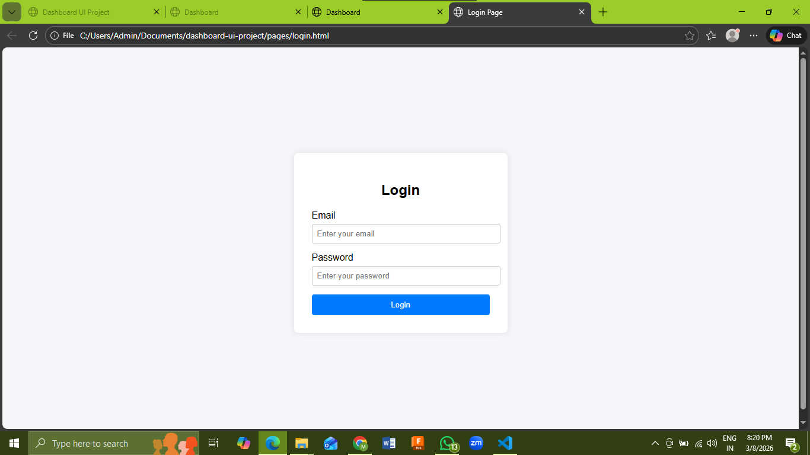
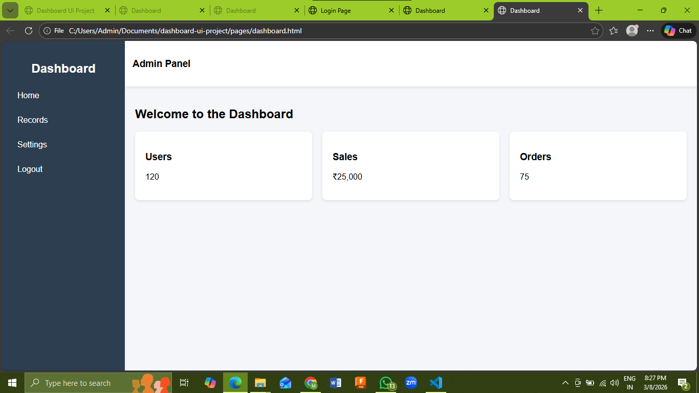
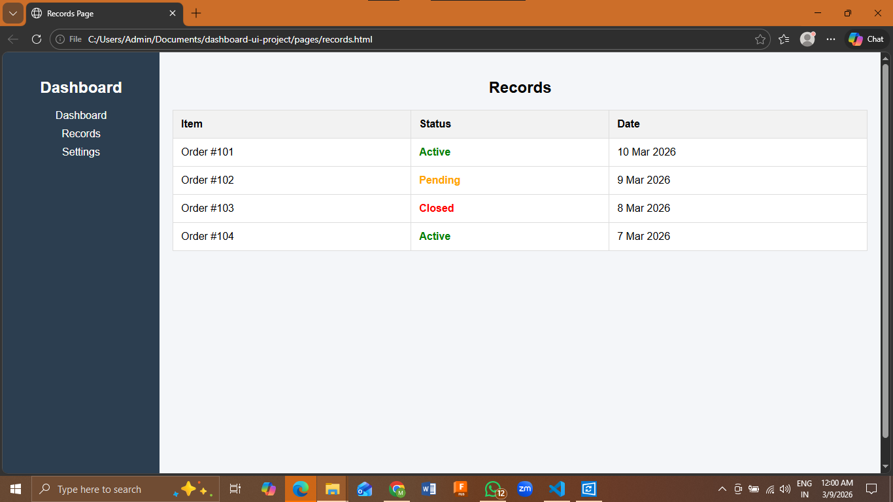

# dashboard-ui-project
admin dashboard UI project with login, dashboard and records page.

## Project Overview
This project is a simple admin dashboard interface built using HTML and CSS.  
It demonstrates the basic layout structure of professional dashboards including a sidebar, header, and content area.

# Static Dashboard Project

## What I Built
I built a simple static dashboard interface using HTML and CSS.  
The dashboard includes a login page, dashboard page, and records page.

## Folder Structure

dashboard-ui-project
│
├── pages
├── components
├── styles
└── assets

## What I Learned
- Creating structured UI layouts
- Building reusable components
- Organizing project folders
- Using GitHub for project submission

## Screenshots

### Login Page

### Dashboard

### Records

## Demo Video

